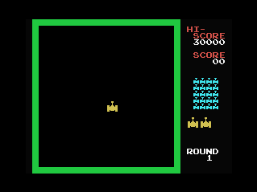

# tank_battalion

Python version of Tank Battalion.


## Notes

Install pygame

```
sudo pip install pygame
```

## Screenshots

Most recent at the top.

Because the game originally has a low resolution (256 x 196), these
screenshots do so as well. 



## Sprites


